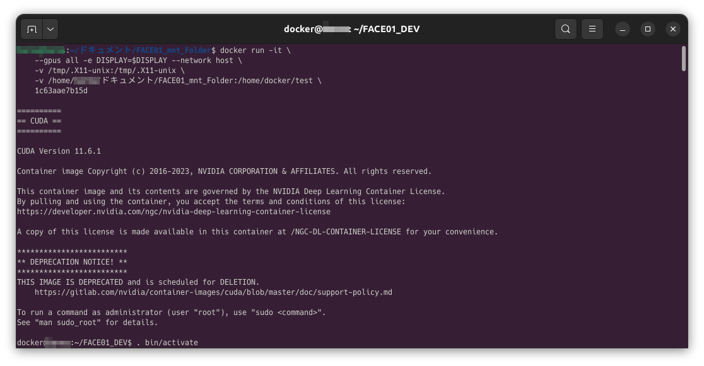
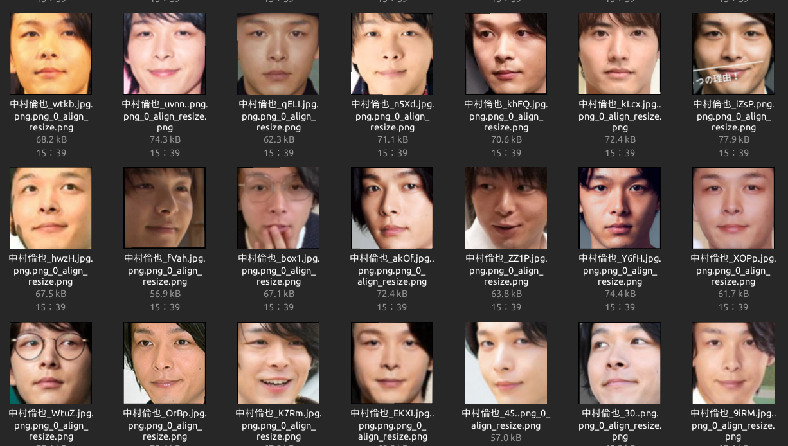
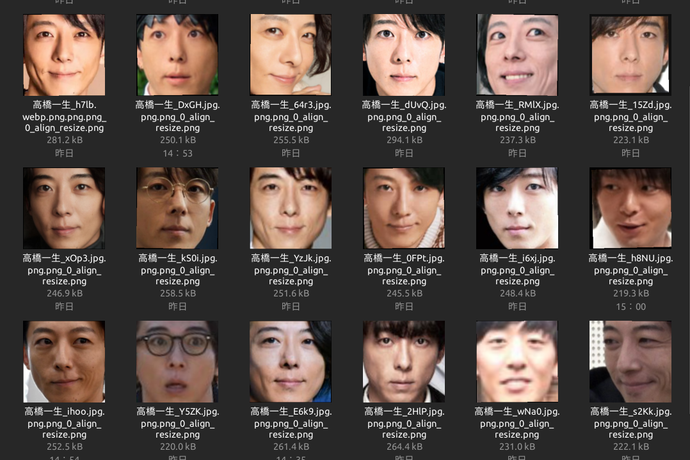
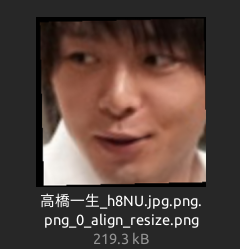

# 顔学習モデルを作成するための、十徳ナイフの使い方

## はじめに
顔認証システムの核、顔学習モデルの作成には苦労が伴います。

お金に物を言わせれば計算資源は確保できます。またわたしの記事では「どのようなバックボーンと損失関数を使用するか」をコードとして紹介していますし、昨今なら大規模LLMにコードを書かせることもできるでしょう。

苦労するポイントは「**良質な顔データセットを作成**」するところにあります。

昔はスクレイピングひとつにしてもオライリーの本が出ていたほどですが、これも大規模LLMがコードを書いてくれます。[^1]
[^1]: 個人の経験値に基づいた、秘伝のタレ的コードも、そのうち出来るようになるのでしょうね。

**しかしそこから先、何百GBも画像を集めて、どうすればいいですか？**

この記事では「そこから先」をご案内し、その上で使える十徳ナイフの使い方をご紹介します。

顔学習モデル作成に限りませんが、**深層学習はデータセットが9割**です。

ここでは拙作の**顔学習フレームワークFACE01を使って、半自動的に良質な顔データセットを作成する方法**について共有します。


## 前提
:::details 前提
- ホストマシンにGPUが搭載されているとします。（VRAM4GBでも構いません）
- Linuxマシンで実行することを想定しています。
- x11環境を想定しています。Wayland環境の方は読み替えてください
- 記事に載せる顔画像は記事用に用意したものです
:::

## 環境
:::details 環境
```bash
$ inxi -SG --filter
System:
  Kernel: 6.8.0-51-generic x86_64 bits: 64 Desktop: GNOME 42.9
    Distro: Ubuntu 22.04.5 LTS (Jammy Jellyfish)
Graphics:
  Device-1: NVIDIA TU116 [GeForce GTX 1660 Ti] driver: nvidia v: 555.42.06
  Display: x11 server: X.Org v: 1.21.1.4 driver: X: loaded: nouveau
    unloaded: fbdev,modesetting,vesa failed: nvidia gpu: nvidia
    resolution: 2560x1440~60Hz
  OpenGL: renderer: NVIDIA GeForce GTX 1660 Ti/PCIe/SSE2
    v: 4.6.0 NVIDIA 555.42.06
```
:::

## FACE01の準備
:::details FACE01の準備
### docker pull
まず最初にFACE01が実行できるよう準備をします。
以下のようにDockerイメージをプルしてください。

```bash
docker pull tokaikaoninsho/face01_gpu
```
### Xサーバーのローカルホスト接続許可
```bash
xhost +local:
```
### コンテナ起動してアタッチ
```bash
# 例:
docker run -it \
    --gpus all -e DISPLAY=$DISPLAY --network host \
    -v /tmp/.X11-unix:/tmp/.X11-unix \
    -v <path/to/your/dir>:/home/docker/test \
    <Image ID>
```
### Python仮想環境をアクティベート
```bash
. bin/activate
```

:::

## aligned_crop_face.py
### Summary:
スクレイピングや入力映像から特定人物の大量の画像を入手したとして、それらはそのままでは学習に使えません。
顔を検出し、任意のパディングで顔画像を切り抜き、顔の方向を整える必要があります。

### Args:
path (str): 顔画像が存在するディレクトリパス
size (int, optional): 抽出する顔画像のピクセル数を整数で指定します。デフォルトは400です。

### Example:
```bash
python example/aligned_crop_face.py <path> <size>
```

### Result:
/docs/img/face_alignment.png

## make_find_and_move_same_faces.py
### Summary:
まず、顔データセットに重要なことは、それぞれのIDごとに多様性が必要であることです。
たとえばインタビュー映像を入力してそこからその人の顔データセットを作成できますが、その場合は同一光源であったり同一のレンズであったりするため、多様性が乏しいと言えます。個人的な経験上、このようなデータセットで学習されたモデルは汎用性が著しく劣ります。しかしデータセットを拡充する上でこの方法は避けて通れません。そこでFACE01にはどれくらいに通った顔がデータセットにあるかを判断し、同じような顔であれば別フォルダに移動するスクリプトがあります。

このスクリプトは、指定したディレクトリとそのサブディレクトリ内にある`npKnown.npz`ファイルを読み込み、512次元の顔認識ベクトルのコサイン類似度に基づいて同一の顔画像を検出し、同一と判断された画像ファイルを各サブディレクトリごとの`same_face`フォルダに移動します。
`same_face`フォルダは各サブディレクトリに存在しない場合は自動で作成されます。

各`npKnown.npz`ファイルには、人物名とその512次元の特徴量データが含まれており、このデータを基に類似性を評価します。類似度が閾値以上のものは同一とみなし、重複する顔画像を`same_face`フォルダに集約します。

### Example:
```bash
python  example/make_find_and_move_same_faces.py /path/to/root_dir --threshold 0.95
```
### 
## make_noKnown_for_subdir_noGUI.py
顔画像はそのままでは処理できません。顔画像一つ一つを512次元ベクトルデータに変換し、任意の順序で格納する仕組みが必要です。
まず考えられるのがデータベースの活用ですが、pythonコードから読み込む場合、numpy配列であるのならばnpzとしてバイナリデータとして保存するのが簡便であり、読み込みが速いです。
このコードはそのフォルダ（ID・クラス）に存在するすべての顔画像に対して512次元ベクトルデータ（テンソル？）に変換し、バイナリデータとしてnpzとして固めます。
これにより他のユーティリティが計算処理することを可能にします。


## display_GUI_window_JAPANESE_FACE_V1
実際に入力映像を確認しながら切り抜くべき顔を検出して表示します。また、任意のフレーム間隔で顔画像を切り抜きます。このとき、任意の大きさを指定できます。もし入力映像を確認する必要がなければsimple.pyにて同じことが出来ます。こちらは映像を表示する機能がない分、高速に動作します。


```bash
python example/display_GUI_window_JAPANESE_FACE_V1.py && \
mv output/*.png ../test && \
python example/aligned_crop_face.py ../test && \
zenity --info --text="Face_Crop: Done"
```

## faiss_combination_similarity.py
### Summary:
クラス数が膨大になると同じ人物が別クラスに紛れることがあります。これを目視で確認するのは不可能です。また組み合わせ総数が膨大になるためすべての計算を順列に行えば現実的な時間で処理できなくなります。
このスクリプトではfaissを用いて組み合わせ爆発を防ぎ、非常に短い時間で、すべてのクラスに対して類似度を計算し、任意の類似度以上の組み合わせを出力します。
### Example:
```bash
python3 example/faiss_combination_similarity.py
```




### Result:
プロジェクトルートディレクトリにoutput.csvが作成されます。
```bash
# 抜粋
高橋一生_h8NU.jpg.png.png_0_align_resize.png
中村倫也_ZZ1P.jpg.png.png_0_align_resize.png
0.971019446849823
```

## distort_barrel.py
[Illustration of transforms](https://pytorch.org/vision/main/auto_examples/transforms/plot_transforms_illustrations.html#sphx-glr-auto-examples-transforms-plot-transforms-illustrations-py)
例えば上記のtorchvisionではデータ拡張のための色々な機能がありますが、レンズにまつわるデータ拡張機能はありません。
このスクリプトを使用すると様々なレンズ歪みをシミュレートすることができます。それによって学習データの汎用性を向上させます。

## data_augmentation.py
樽型歪みに加えてjitterも加えたデータ拡張を提供します。マルチプロセス版のdata_augmentation_mp.pyもあります。

## 補足①: 目視による顔データの取捨選択
以上のように顔データセット作成の少なくない部分を半自動化できますが、最終的な目視による確認は欠かせません。

非常に大事なことですが、**顔学習モデルの認識力は、顔学習モデルの作者を超えることはない**です。

### 修正

### そら似

## 補足②: データセット作成方針
顔データセットには多様性が重要ですが、どこまでの多様性を含めるか前もって方針をたてておかねばなりません。

### 年齢

### 表情


## リンク
- [Docker Hubリポジトリ](https://hub.docker.com/r/tokaikaoninsho/face01_gpu)
- [FACE01リポジトリ](https://github.com/yKesamaru/FACE01_DEV)